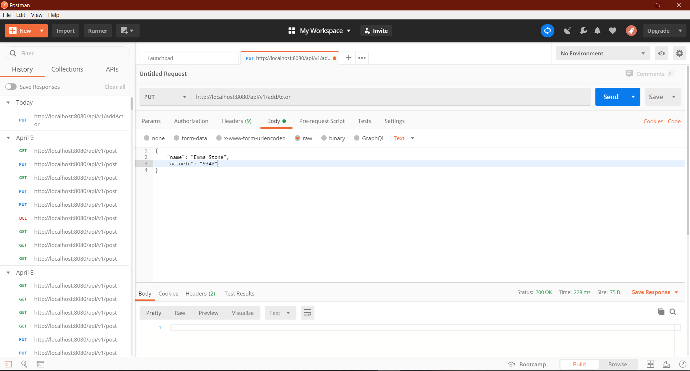

# Six Degrees of Kevin Bacon 

For this project I have implement the backend for a service that computes six degrees of Kevin Bacon. This problem can be restated as finding the shortest path between Kevin Bacon and a given actor (via shared movies).

## 

## Examples

### 2.1 George Clooney

Consider the actor George Clooney: 

- George Clooney acted in “Good Night, and Good Luck” with Patricia Clarkson 
- Patricia Clarkson acted in “Beyond All Boundaries” Kevin Bacon 

So we would say that George Clooney has a “Bacon number” of 2.

### 2.2 Bud Collyer

Consider the actor Bud Collyer: 

- Bud Collyer was in “Secret Agent” with Jackson Beck 
- Jackson Beck was in “Hysterical History” with Mae Questel 
- Mae Questel was in “Who Framed Roger Rabbit” with Frank Welker 
- Frank Welker was in “Balto” with Kevin Bacon 

So we would say that Bud Collyer has a “Bacon number” of 4.

## Files for Neo4j

- actors.tsv: List of actors and some attributes

  ```
  nconst(actorId) primaryName(name) birthYear deathYear primaryProfession knownForTitle
  ```

  

- movies.tsv: List of movies and some attributes

  ```
  tconst(movieId) titleType primaryTitle(name) originalTitle isAdult startYear endYear runtimeMinutes genres
  ```

  

- relationships.tsv: List of movies and their actors

  ```
  tconst ordering nconst category job characters
  ```

## Testing Endpoints

To test the endpoints I used Postman.

### Sending a Request 

- Open up Postman and select the type of request you would like to send 
- Enter in your request url 
- Open up the request body tab and select raw
- Enter in your request body data into the test box 
- Click Send 




## Project/IDE Setup

### Command Line

- Install maven 

- To compile your code simply run mvn compile in the root directory (the folder that has pom.xml) 

- To run your code run mvn exec:java

  Command Line

#### Eclipse

- File → Import → Maven → Existing Maven Projects 
- Navigate to the project location 
- Right click the project → Maven Build… 
- Input compile exec:java in the Goals input box 
- Click apply then run/close 
- You can now run the project by pressing the green play button

#### Neo4j

- Download and install Neo4j desktop
- Add Database and create a local Graph
- Set the `username: neo4j`
- Set the `password: 1234`
- Select the graph version 3.5.17 for this project 
- Start the Neo4j Graph and use the browser for visual help
- Now the server will not disconnect when the project is run in java

## API Usage

The following REST API endpoints run on port 8080. For those unfamiliar with REST a detailed description can be found here (https://www.codecademy.com/articles/what-is-rest). 

### 1. PUT /api/v1/addActor

Adds an actor node to the database.

#### Body Parameter Types: 

```
name : string
actorId: string
```

#### Body: 

```
{
    "name": "Emma Stone",
    "actorId": "9348"
}
```

#### Response: 

- `200 OK` for a successful add 
- `400 BAD REQUEST` if the request body is improperly formatted or missing required information 
- `500 INTERNAL SERVER ERROR` if save or add was unsuccessful (Java Exception is thrown)

### 2. PUT /api/v1/addMovie

Adds a movie node to the database.

#### Body Parameter Types: 

```
name : string
movieId: string
```

#### Body: 

```
{
"name": "Graduation",
"movieId": "742053"
}
```

#### Response: 

- `200 OK` for a successful add 
- `400 BAD REQUEST` if the request body is improperly formatted or missing required information 
- `500 INTERNAL SERVER ERROR` if save or add was unsuccessful (Java Exception is thrown)

### 3. PUT /api/v1/addRelationship

Adds a relationship between a movie node and an actor node. We will assume that each movie is acted by at least one actor.

#### Body Parameter Types: 

```
actorId : string
movieId: string
```

#### Body: 

```
{
"actorId": "9348",
"movieId": "742053"
}
```

#### Response: (no response body)

- `200 OK` for a successful add 
- `400 BAD REQUEST` if the request body is improperly formatted or missing required information 
- `404 NOT FOUND` if the actors or movies do not exist when adding a relationship
- `500 INTERNAL SERVER ERROR` if save or add was unsuccessful (Java Exception is thrown)

### 4. GET /api/v1/getActor

Gets actor id, name, and all the movies they have acted in. We should assume Kevin Bacon is in the database.

#### Body Parameter Types: 

```
actorId: string
```

#### Body: 

```
{
"actorId": "9348"
}
```

#### Response: 

- `200 OK` for a successful add 
- `400 BAD REQUEST` if the request body is improperly formatted or missing required information 
- `404 NOT FOUND`  if there is no actor in the database that exists with that actorId
- `500 INTERNAL SERVER ERROR` if save or add was unsuccessful (Java Exception is thrown)

#### Response Body Parameter Types: 

```
actorId: string
name: string
movies: list of strings
```

#### Response Body: 

```
{
    "actorId": "9348",
    "name": "Emma Stone",
    "movies": [
        "838362",
        "56789765",
        "45678",
        ...
    ]
}
```


### 5. GET /api/v1/getMovie

Gets the movie id, name, and all actors that acted in it.

#### Body Parameter Types: 

```
movieId: string
```

#### Body: 

```
{
"movieId": "284764"
}
```

#### Response: 

- `200 OK` for a successful add 
- `400 BAD REQUEST` if the request body is improperly formatted or missing required information 
- `404 NOT FOUND`  if there is no movie in the database with the requested movieId
- `500 INTERNAL SERVER ERROR` if save or add was unsuccessful (Java Exception is thrown)

#### Response Body Parameter Types: 

```
movieId: string
name: string
actors: list of strings
```

#### Response Body: 

```
{
    "movieId": "284764",
    "name": "Holes",
    "actors": [
        "838334",
        "567823",
        "41394",
        ...
    ]
}
```


### 6. GET /api/v1/hasRelationship

Returns the boolean value of if an actor has acted in the movie. true if they have, false if they haven’t.

#### Body Parameter Types:

```
actorId: string
movieId: string
```

#### Body: 

```
{
"actorId": "93847",
"movieId": "284764"
}
```

#### Response: 

- `200 OK` for a successful add 
- `400 BAD REQUEST` if the request body is improperly formatted or missing required information 
- `404 NOT FOUND`  if the actorId or movieId doesn’t exist in the database
- `500 INTERNAL SERVER ERROR` if save or add was unsuccessful (Java Exception is thrown)

#### Response Body Parameter Types: 

```
actorId: string
movieId: string
hasRelationship: boolean
```

#### Response Body: 

```
{
    "actorId": "93847",
    "movieId": "284764",
    "hasRelationship": true
}
```


### 7. GET /api/v1/computeBaconNumber

Returns the Bacon Number of given actor. If you compute the BaconNumber of Kevin Bacon himself, you should return 0.

#### Body Parameter Type:

```
actorId: string
```

#### Body: 

```
{
	"actorId": "9348"
}
```

#### Response: 

- `200 OK` if a path is found 
- `400 BAD REQUEST` if the request body is improperly formatted or missing required information or if the actor does not exist 
- `404 NOT FOUND` if a path cannot be found 
- `500 INTERNAL SERVER ERROR` if save or add was unsuccessful (Java Exception is thrown)

#### Response Body Parameter Types: 

```
baconNumber: string
```

#### Response Body: 

```
{
	"baconNumber": "3"
}
```


### 8. GET /api/v1/computeBaconPath

Returns the shortest Bacon Path in order from actor given to Kevin Bacon. 

If an actor acted in a movie but does not have a path to Kevin Bacon, then return an empty list in “baconPath” inside the response body. If there is more than 1 baconPath with the same baconNumber, then return a random baconPath.

#### Body Parameter Type:

```
actorId: string
```

#### Body: 

```
{
	"actorId": "9348"
}
```

#### Response: 

- `200 OK` if a path is found 
- `400 BAD REQUEST` if the request body is improperly formatted or missing required information or if the actor does not exist 
- `404 NOT FOUND` if a path cannot be found 
- `500 INTERNAL SERVER ERROR` if save or add was unsuccessful (Java Exception is thrown)

#### Response Body Parameter Types: 

```
baconNumber: string
baconPath: list of objects with actorId: string and movieId: string
```

#### Response Body: 

```
{
    "baconNumber": "5"
    "baconPath":[
        {
            "actorId": "9348",
            "movieId": "4079"
        },
        {
            "actorId": "5320",
            "movieId": "4079"
        },
        	...
        {
            "actorId": "nm0000102",
            "movieId": "4079"
        }
    ]
}

```


## Nodes

### Actor

- Has the node label `actor`
- Has the following properties
  - `id` 
  - `Name`

### Movie

- Has the node label `movie` 
- Has the following properties 
  - `id` 
  - `Name`

### Relationship - Acted In

- Relationship label `ACTED_IN`

## Support

For any questions contact  me at gurashish1000@gmail.com
